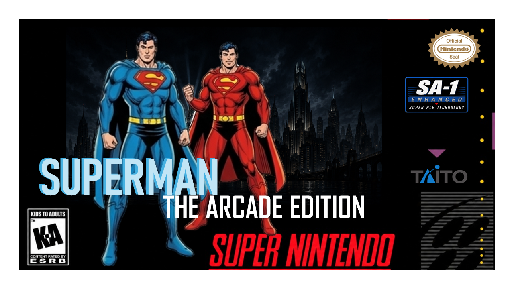
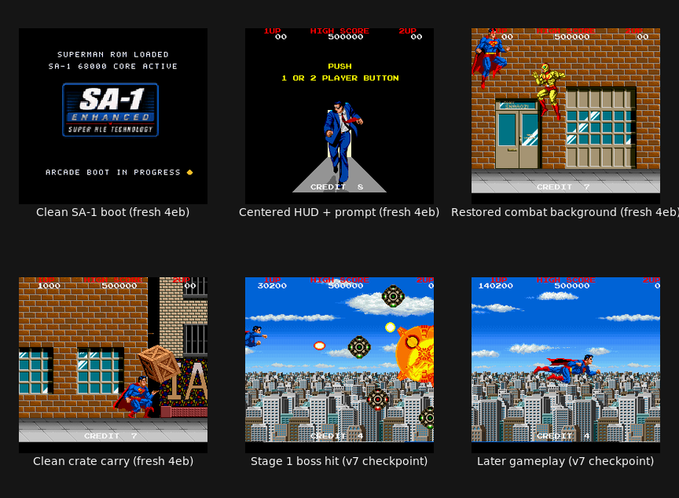

<p align="center">
  
</p>

<h1 align="center">Superman: The Arcade Edition for SNES / SA-1</h1>

<p align="center">
  A reverse-engineered port of Taito's 1988 arcade game—running its original
  MC68000 program on Super Nintendo hardware with the SA-1 coprocessor.
</p>

<p align="center">
  <strong>Current status: interactive technical preview.</strong><br>
  Visually convincing and controllable in bounded tests, but not yet a qualified
  playable demo or release.
</p>

## An arcade port, not a remake

The project executes the original game program through a hand-written 65816
interpreter, then replaces measured hot paths with native 65816 code. Taito X
video is translated to the SNES PPU, and YM2610 music and effects are adapted to
the Terrific Audio Driver.

- **Arcade truth:** MAME 0.287
- **SNES/SA-1/PPU truth:** the MCP-enabled Nexen emulator
- **Execution model:** interpret-cold / native-hot
- **Target:** a 4 MiB SA-1 SNES ROM built from legally supplied arcade inputs

## Visual progress

<p align="center">
  
</p>

The showcase contains real emulator captures. The first four panes are fresh-boot
visual evidence from the preserved `4eb9a408…` line: clean SA-1 boot, centered
HUD/start prompt, restored storefront combat background, and clean crate carry.
The final two panes are clearly labeled v7 checkpoint evidence. The montage is a
visual review bundle, not proof that one ROM has passed every release gate.

Concept cover contributed by Chad.

## What works today

- Cold boot, coin/start input, and real controller-driven gameplay in bounded runs.
- Button 1 punch/fire/charge, Button 2 kick, flight, damage, death, and respawn.
- Crate pickup, carry, contact, and throw paths.
- Corrected combat background, crate tiles, SA-1 boot presentation, and centered HUD.
- Exact MC68000 semantic gates: optest 160/160 and opsweep 782/782.
- Focused Stage 1–3 boss-health differentials and all 14 retained Stage 1 boss
  observations.
- VGM-derived TAD audio integration in controlled tests.

## Why it is not called a playable demo yet

The strongest fresh ordinary candidate (`a9765fbf…`) is validated through tick
10,000. The unpromoted v8 diagnostic (`162b757c…`) continues without an oracle
divergence through MAME tick 31,000 / SNES tick 30,994, but it reached that point
through authenticated save-state migration rather than a fresh power-on run.

The retained movie ends at tick 139,925, so 31,000 ticks is 22.15% coverage. The
campaign is intentionally paused at a repeat-validated tick-31,000 state for human
visual review and can resume at tick 31,001 without replaying the prefix.

Before the project earns “playable demo,” it still needs:

- a promoted current ROM with fresh-power-on stage and boss continuity;
- organic Stage 2 and later-stage renderer coverage;
- a human combat and audio playtest;
- current end-to-end performance at 30 game ticks/s and no more than 358K SA-1
  cycles/tick;
- aligned MAME pixel checks, renderer conservation, and attack-animation coverage;
- real-hardware acceptance.

The latest qualifying performance run is older v124: 29.700167 game-fps and
360,990.164 SA-1 cycles/tick, narrowly missing both gates.

Read the [authoritative status](docs/current/STATUS.md),
[engineering checkpoint](docs/current/ENGINEERING_CHECKPOINT_20260811.md), and
[release blockers](docs/current/RELEASE_BLOCKERS.md) for the exact evidence scopes
and ROM identities.

## Build

No arcade ROM data is included. Supply a legally obtained MAME 0.287 `superman`
World ROM set.

```sh
python3 tools/prepare_roms.py /path/to/superman.zip
bash tools/build_interp.sh
sha256sum build/interp.sfc
```

The ROM is written to `build/interp.sfc`. Exact FM authoring WAVs are separate
private VGM/ymfm inputs; the preparer derives the program, graphics, C-Chip
response, and drums but does not invent replacements for those WAVs.

See [complete build and toolchain setup](docs/current/BUILDING.md) and
[private-input details](docs/current/ROM_INPUTS.md).

## Controls

| SNES | Arcade action |
|---|---|
| Select | Coin |
| Start | Start |
| D-pad | Move; Up enters flight |
| B or Y | Button 1: punch/fire; hold and release for charged shot |
| A or X | Button 2: kick |

The arcade game has two action buttons; there is no jump action. See
[controls and playtesting](docs/current/CONTROLS.md).

## Documentation

The [documentation index](docs/README.md) covers current Superman status, the
reusable MC68000 arcade-to-SNES toolchain, Gigandes onboarding, and preserved
historical evidence. Historical claims never override `docs/current/STATUS.md`.

## Legal boundary

Original project source and documentation may be tracked. Arcade ROMs, assembled
ROM regions, VGM/source audio without redistribution authorization, derived audio
samples, and SNES ROM builds remain private and gitignored.
